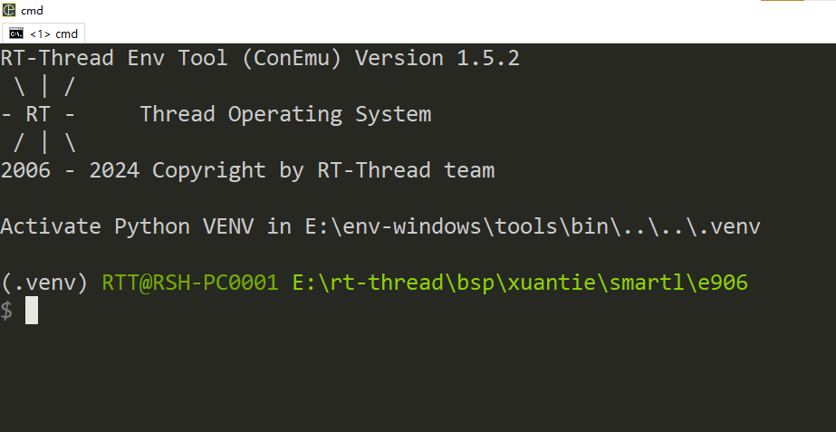

# XuanTie - R908  Series

## 一 简介

### 1. 内核

R908 是一款兼容 RISC-V 架构的 64 位处理器，是面向高可靠性高实时性需求的玄铁 R 系列产品新成员。它在架构上做了全面的更新和升级，对实时性和可靠性做了全面提升，专为高端工控、存储控制、通信计算、车载等有高实时性高可靠性要求的领域设计。

R908 采用同构多核架构，支持多 cluster，每个 cluster 支持 1~4 个核心。每个 R908 核心采用自主设计的微体系结构，并重点针对性能进行优化，采用按序双发射、多模式分支预测和多通道数据预取等高性能技术。此外，R908 核心支持实时检测并关断内部空闲功能模块，降低处理器动态功耗。

### 2.特点

• RISC-V 64GCB[V] 指令架构；

• User Mode 支持 RV64 和 RV32 指令集；

• 支持小端模式；

• 9 级流水架构；

• 按序双发射，按序取指、发射、执行和退休；

• 两级 TLB 内存管理单元，实现虚实地址转换与内存管理；

• 指令高缓和数据高缓大小可配置，支持 16KB/32KB/64KB，缓存行为 64B；

• 指令高缓可配置奇偶校验，数据高缓可配置 ECC 或奇偶校验；

• 指令预取功能，硬件自动检测并动态启动；

• 指令高缓路预测的低功耗访问技术；

• 支持 2KB/4KB/8KB 的多算法分支预测器；

• 支持 256 表项的分支目标缓存器（BTB）；

• 支持 8 层的硬件返回地址堆栈；

• 支持 256 表项的间接跳转分支预测器；

• 支持循环终止预测；

• 支持指令融合技术；

• 双发射按序执行 Load、Store 指令；

• 读、写内存分别支持 8 路、12 路并发的总线访问；

• 支持写合并；

• 支持 8 通道数据预取，支持固定 stride 和规律性不定 stride 数据预取；

### 3.BSP支持情况

- 当前BSP支持下述内核：

  ```asciiarmor
  r908
  ```

- 当前BSP默认设置的内核是r908，该架构支持[F] [D]扩展，可以通过menuconfig工具使能[F]扩展或者[F] [D] 扩展。

- 当使用其他内核架构时需要修改，rtconfig.py文件中的`MCPU`字段。

### 4.运行QEMU

- BSP根目录下存在`qemu.bat`脚本，生成可执行文件后可点击该脚本直接启动QEMU.

## 二 工具

- 编译器： https://www.xrvm.cn/community/download?id=4433353576298909696
- 模拟器： https://www.xrvm.cn/community/download?id=4397435198627713024

注：若上述链接中的编译器与模拟器不能使用，可以使用下述CDK中的编译器与模拟器

- SDK：https://www.xrvm.cn/community/download?id=4397799570420076544

## 三 调试方法

**下述调试方法以E906举例，本BSP操作方式一致**，搭建完成RT-Thread开发环境，在BSP根目录使用env工具在当前目录打开env。



使用前执行一次**menuconfig**命令，更新rtconfig.h配置，然后在当前目录执行**scons -j12**命令编译生成可可执行文件。


生成可执行文件，可以直接在命令行启动qemu或者配置vscode脚本借助vscode强大的插件进行图形化调试，qemu的相关命令可以查看玄铁qemu的[用户手册](https://www.xrvm.cn/community/download?id=4397435198627713024)，下述是启动qemu的命令，在powershell或命令行可直接执行下述命令，注意qemu需要导出至环境变量或者使用绝对路径。

```shell
qemu-system-riscv64 -machine smartl -nographic -kernel rtthread.elf -cpu e906
```

下述是使用vscode调试的展示。


一起为RISC-V加油！